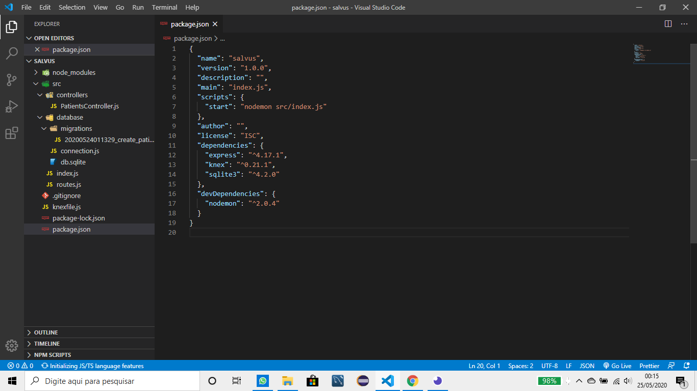
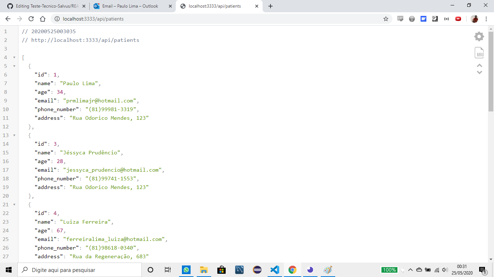
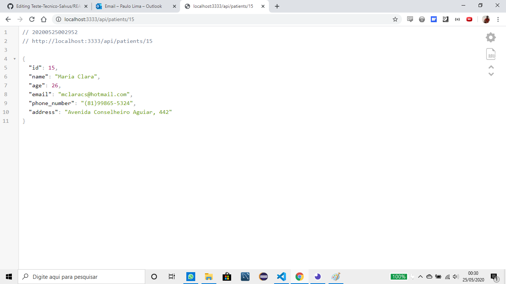
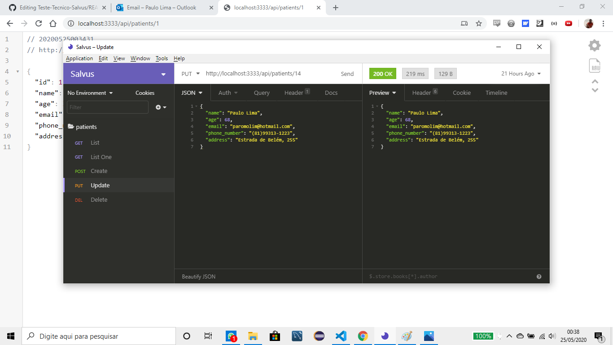

## Teste de Desenvolvimento Para o Processo Seletivo de Estágio em Desenvolvimento de Software da Salvus

Foi solicitado a implementação de uma aplicação capaz de criar, ler, atualizar e excluir dados de uma entidade. Foi também desenvolvido um serviço de rotas para que os dados possam ser acessados, seguindo o princípio de uma arquitetura REST.

Não foi solicitado a construção do Front End. O Back End foi desenvolvido em NodeJS, usando o framework Express. Foi usado o banco SQLite para armazenamento dos dados e criação da entidade.

## Passo a Passo

Baixar o conteúdo do repositório e executar o comando npm install para instalar as dependências.

A aplicação se organiza conforme a estrutura de pastas abaixo.

Para executar a aplicação usa-se o comando npm start. 

Pode-se acessar os dados através do caminho http://localhost:3333/api/patients e os dados de um paciente em específico passando-se a id dele, por exemplo http://localhost:3333/api/patients/15

As funções de Criar, Atualizar e Deletar estão implementadas e prontas para serem utilizadas. Foi usado o Imsomnia para testar as funções. 

